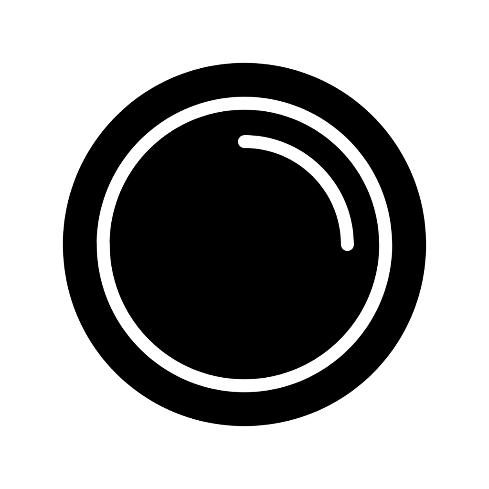

# Lensify


Lensify is an iOS application that leverages Optical Character Recognition (OCR) and real time audio transcription to capture audiovisual inputs, that can be exported via ShareLink as PDFs. 

## Features

- **Optical Character Recognition (OCR)**: Quickly extract text from images and documents.
- **Real-time Audio Transcription**: Convert spoken words into text in real-time.
- **Built-in Document Storage**: Store trancriptions locally on device using app storage. Export them or delete them as needed. 

## Requirements

- iOS 14.0+
- Xcode 12.0+
- Swift 5.3+

## Installation

1. Clone the repository:
   ```
   git clone https://github.com/jrein77/Lensify.git
   ```
2. Open the project in Xcode:
   ```
   cd Lensify
   open Lensify.xcodeproj
   ```
3. Build and run the project on your iOS device or simulator.

## Usage

### Visual Mode


1. Launch the app and navigate to Visual mode.
2. Point device at piece of text for a couple of seconds. 
3. Image in the text will be visualized in the ui. 

### Audio Mode


1. Go to the Audio mode.
2. Start speaking into the mic and transcriptions will appear on screen.
3. Transcriptions will clear from the screen, this is normal. Everything is saved and can be exported when finished.

## Multi Mode


1. Click multi mode. 
2. Everything in audio and visual modes but at the same time.

## Contributing

We welcome contributions to Lensify! If you have a feature request, bug report, or want to contribute code, please follow these steps:

1. Fork the repository.
2. Create a new branch for your feature or bug fix.
3. Commit your changes with clear, descriptive messages.
4. Push your branch and submit a pull request.

## Note

Audio transcription durations depend on device and content being processed. Transcripts periodically clear from the UI, and new audio sessions are started. Audio transcriptions ran for ~2 hours in testing and can likely run for longer, but depends heavily on device capabilities and content being processed. 

## License

Lensify is released under the MIT License. See the [LICENSE](LICENSE) file for details.

## Acknowledgments

- [Vision](https://developer.apple.com/documentation/vision) - Apple's framework for OCR
- [Speech](https://developer.apple.com/documentation/speech) - Apple's framework for speech recognition
